<a id="readme-top"></a>

  <div align="center">
      <h1> Travlr Getaways </h1>
      <h3><em> Module 3: Static HTML to Templates with JSON </em></h3>
  </div>

---

  

---

## Project Overview 

<div align="center">
  <p align="center"> Module 3 enhances the Travlr Getaways website by converting it into a dynamic Express.js application. It uses Handlebars templates and external JSON data files to generate content dynamically, allowing easier content management and maintainability. This project demonstrates server-side rendering, modular MVC architecture, and the use of JSON for data-driven web pages.
  </p>
  <a href="#prerequisites"><strong>Quick Start »</strong></a>
    &nbsp;&middot;&nbsp;
     <a href="#page-previews"><strong> Page Previews »</strong></a>
    &nbsp;&middot;&nbsp;
    <br>
	<a href="https://github.com/apursley2012/CS465-full-stack-dev-I/issues/new"><strong> Report Issue »</strong></a>
    
   
  </p>
  </div>
  
---

## Table of Contents

- [About the Project](#about-the-project)
- [Features](#features)
- [Page Previews](#page-previews)
- [Tech Stack](#tech-stack)
- [Prerequisites](#prerequisites)
- [Installation & Setup](#installation--setup)
- [Usage](#usage)
- [File Structure](#file-structure)
- [Acknowledgements](#acknowledgements)
- [Contact](#contact)
- [FAQs](#faqs)

---

## About The Project

Travlr Getaways Module 3 focuses on transforming static HTML pages into dynamic templates using Handlebars and JSON data. This approach replaces repetitive static HTML code with reusable templates, making the site easier to maintain and update.

The primary goal of this module was to convert the previously static Travel page into a dynamic Handlebars template that reads trip data from a JSON file. This reduces code duplication and enables the website to dynamically render trip information based on external data. 

This module significantly enhances the maintainability and scalability of the Travlr Getaways website by shifting static content management towards a more flexible, data-driven design pattern. This project builds on previous modules and sets the foundation for further backend and database integration.

---

## Features
- **Dynamic Web Pages:** All key pages (Travel, Meals, Rooms, News, About, Contact, Home) are rendered dynamically using Handlebars templates, providing a flexible and scalable site experience.
- **Content Management via JSON:** Page content is stored and managed in external JSON files, enabling easy content updates without changing code or templates.
- **Consistent Navigation:** The site features a reusable header and footer partial that ensures consistent navigation menus and branding across all pages.
- **Image and Media Integration:** Each page displays images associated with content (e.g., meals photos, room photos) pulled dynamically from JSON data.
- **Clean URL Routing:** Express routes handle requests and render the appropriate page templates seamlessly with user-friendly URLs.
- **Modular Codebase:** Separation of concerns with dedicated controllers, routes, views, and data files to simplify maintenance and future development.
- **Scalable Design:** The architecture supports adding new pages or modifying existing ones with minimal effort, thanks to JSON-driven data and templates.
- **Improved User Experience:** Dynamic rendering ensures fast page loads and easy content management for a better end-user experience.
- **Foundation for API or Database Integration:** The design prepares the app for potential backend enhancements like databases or APIs by centralizing data management.
- **Easy Content Updates:** Non-technical users can update site content by editing JSON files without touching the site’s codebase.

---

## Page Previews

### Home Page
<div align="center">
  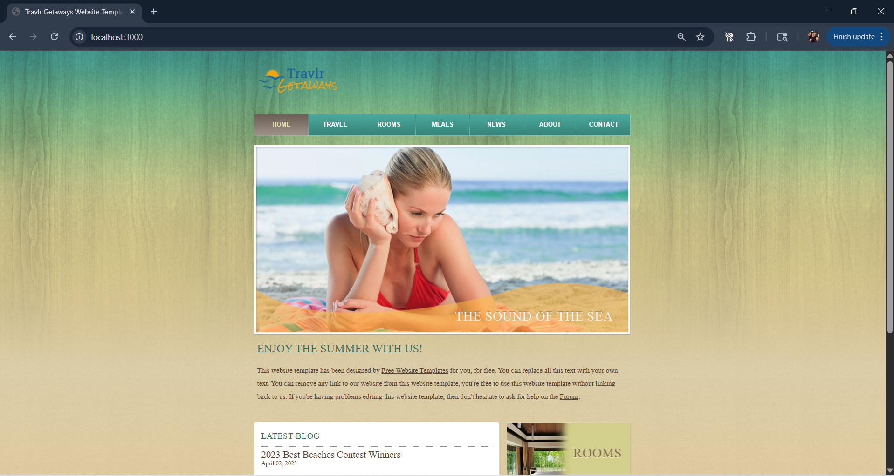
  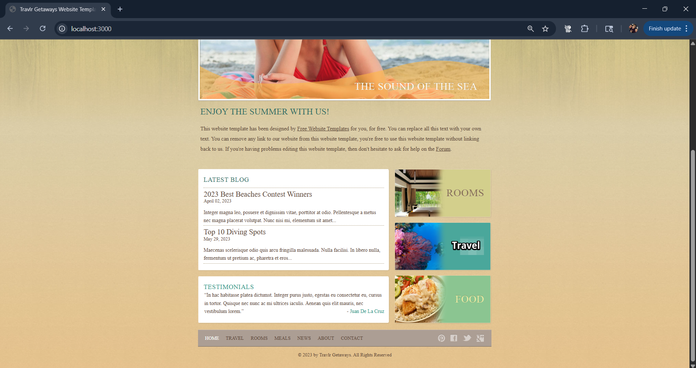
</div>

### Travel Page
<div>
  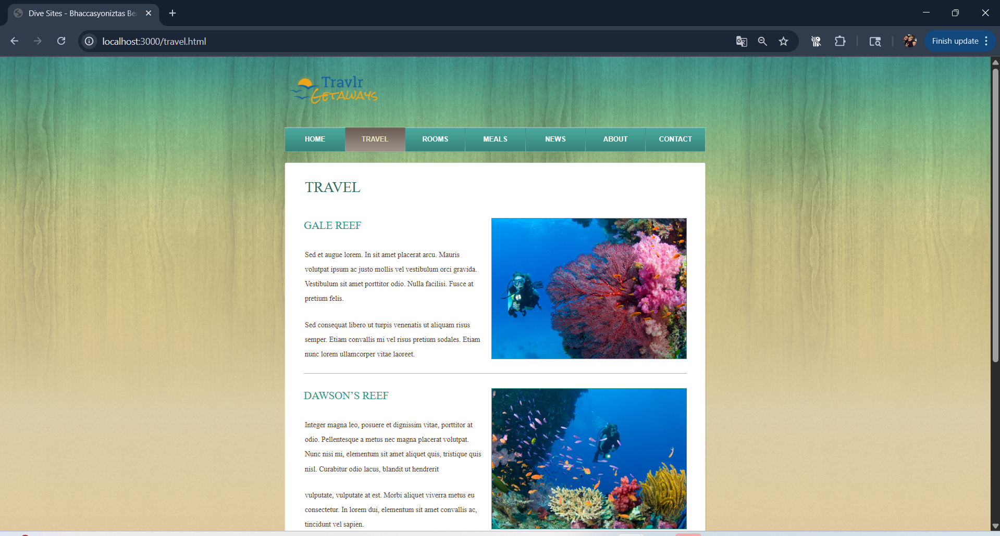
  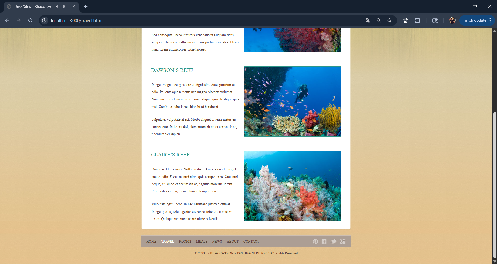
</div>

### Rooms Page
<div>
  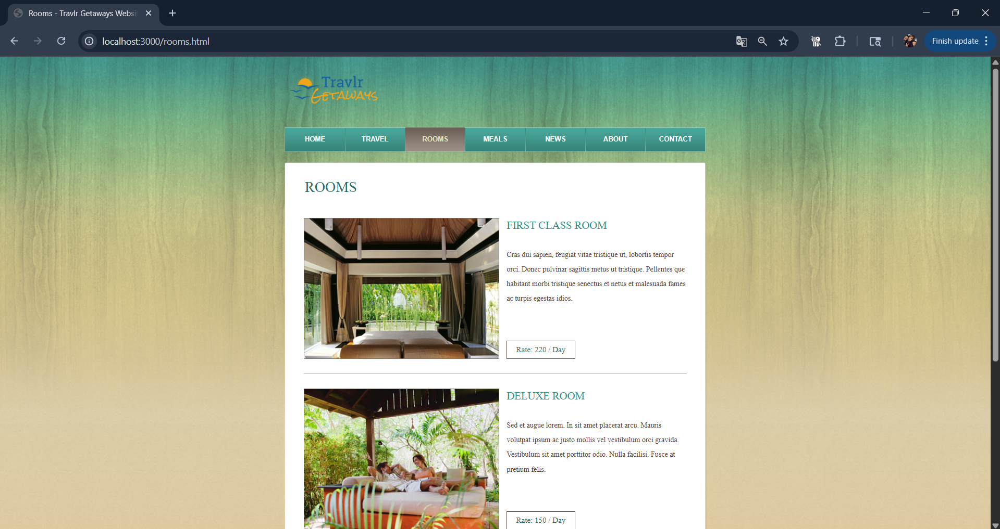
  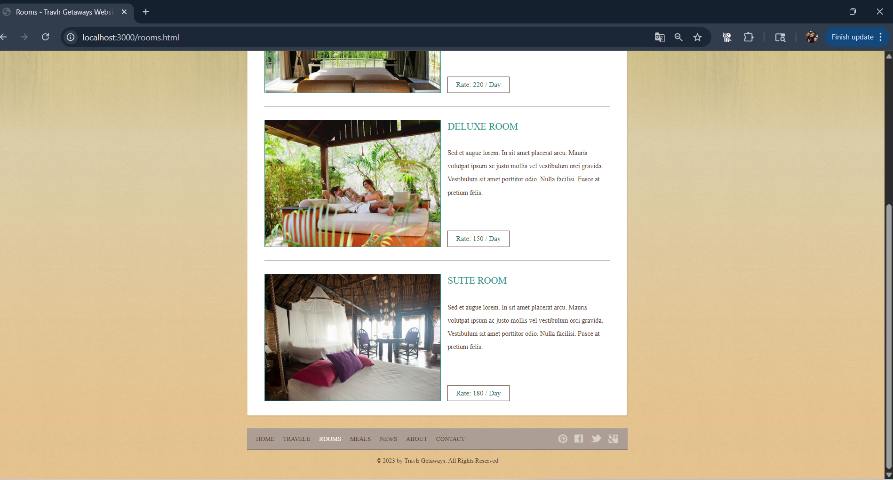
</div>

### Meals Page
<div>
  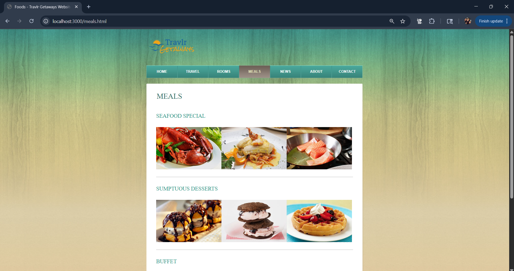
  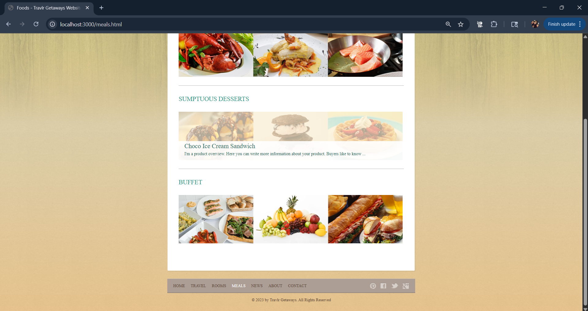
</div>

### News Page
<div>
  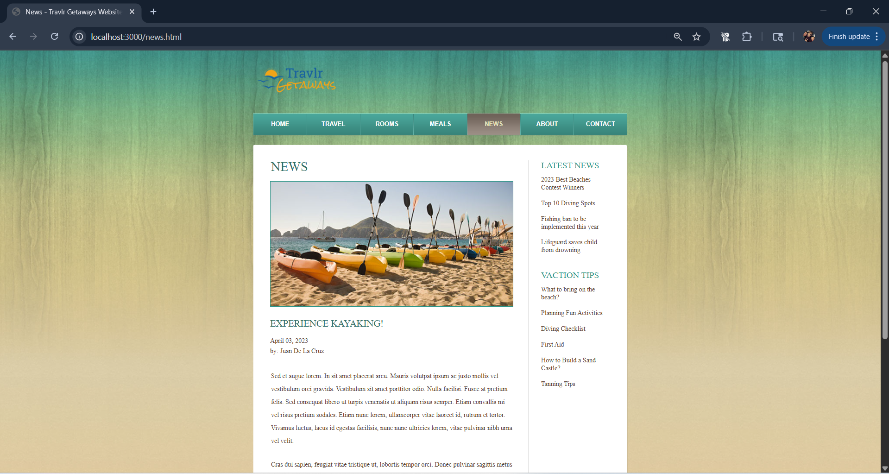
  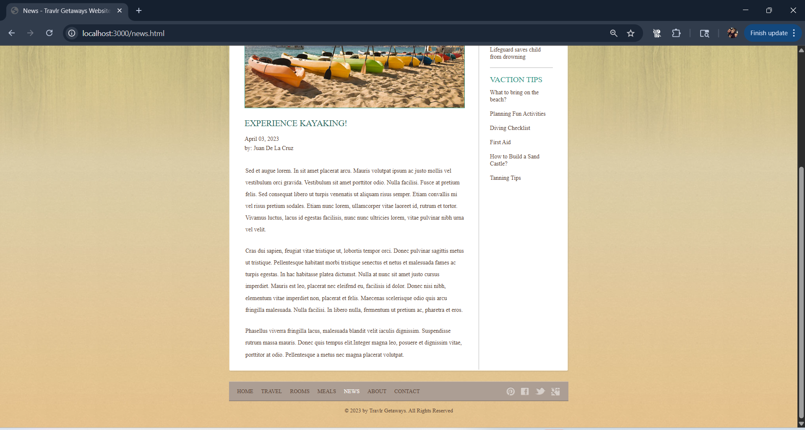
</div>

### About Page
<div>
  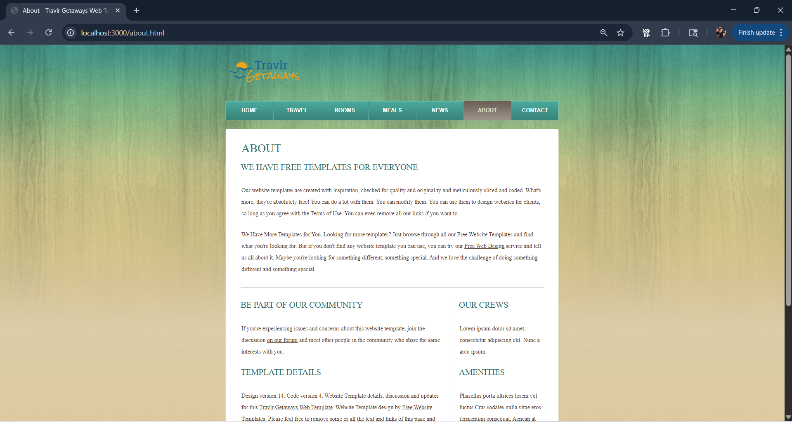
  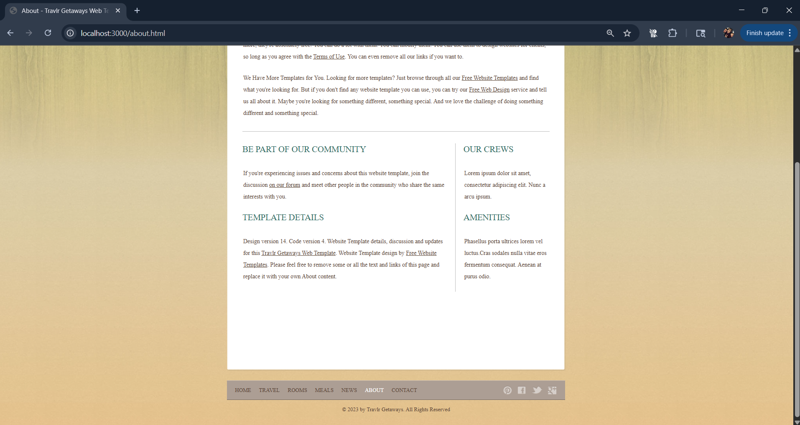
</div>

### Contact Page
<div>
  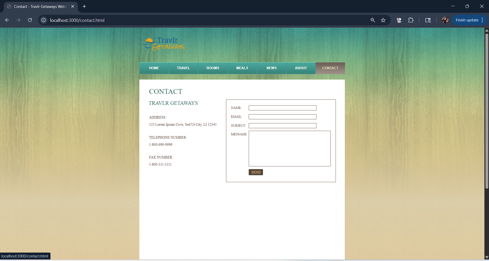
  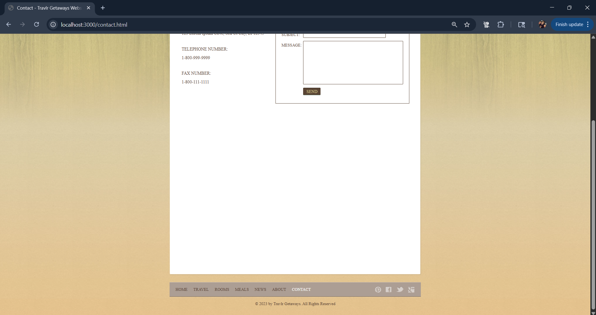
</div>

---

## Tech Stack

- **Node.js** – JavaScript runtime environment used to run the backend server and scripts.
- **Express.js** – Minimal and flexible Node.js web application framework for building the server and handling routing.
- **Handlebars (express-handlebars)** – Templating engine for generating dynamic HTML pages using JSON data.
- **JavaScript (ES6+)** – Core programming language for server logic and dynamic content.
- **HTML5 & CSS3** – Structure and style for the rendered web pages.
- **JSON** – Used for storing and loading trip data.
- **Git** – Version control for managing code changes and collaboration.

# Prerequisites

This guide provides instructions specifically for setting up and preparing to use Visual Studio Code (VS Code) to run the repo locally.

Before attempting to set up the project, ensure the following tools are installed on your system:

## Web Browser

A modern browser like Chrome, Firefox, Edge, or Safari to view the site.

Click a browser icon below to be taken to the download page for that browser. </p>

---

<div align="center">
<table>
  <tr>
    <td align="center">
      <a href="https://www.google.com/chrome/" target="_blank">
        
      </a>
    </td>
    <td align="center">
      <a href="https://www.mozilla.org/firefox/" target="_blank">
        
      </a>
    </td>
    <td align="center">
      <a href="https://www.microsoft.com/edge" target="_blank">
        
      </a>
    </td>
    <td align="center">
      <a href="https://www.apple.com/safari/" target="_blank">
        
      </a>
    </td>
  </tr>
  <tr>
    <td align="center">
      <a href="https://www.google.com/chrome/" target="_blank">Chrome</a>
    </td>
    <td align="center">
      <a href="https://www.mozilla.org/firefox/" target="_blank">Firefox</a>
    </td>
    <td align="center">
      <a href="https://www.microsoft.com/edge" target="_blank">Edge</a>
    </td>
    <td align="center">
      <a href="https://www.apple.com/safari/" target="_blank">Safari</a>
    </td>
  </tr>
</table>
</div>

---

<div>	&nbsp;&nbsp;&nbsp;&nbsp;&nbsp;&nbsp;&nbsp;&nbsp;
	<figure>
		<a href="https://code.visualstudio.com"></a></figure><br>&nbsp;&nbsp;&nbsp;&nbsp;&nbsp;<figcaption>
    <center>
      <a href="https://code.visualstudio.com" target="_blank">
        <em>Download Now</em>
      </a>
    </center>
  </figcaption>
</div>

---
			
## Visual Studio (VS) Code:

*Here's a step-by-step guide to installing Visual Studio Code (VS Code) on your computer, primarily for Windows, with noted differences for macOS and Linux:*  

### Download the installer:
- Open your web browser and go to the official Visual Studio Code website: [code.visualstudio.com](https://code.visualstudio.com).
- Click on the "Download" button for your operating system (Windows, macOS, or Linux).
- The installer file (e.g., `VSCodeUserSetup-x64-1.x.x.exe` for Windows) will begin downloading.  

### Launch the installer:
- Once the download is complete, locate the installer file in your Downloads folder.
- Double-click the installer file to launch the installation process.  

### Follow the installation prompts:
- ***Accept the License Agreement:*** Read and accept the license agreement, then click "Next".
- ***Choose Installation Location:*** The default location is usually fine, but you can choose a different location if needed. Click "Next".
- ***Start Menu Folder:*** Keep the default Start Menu folder name or change it as desired. Click "Next".
    - **Additional Tasks:**
      - On Windows, consider checking the boxes for creating a desktop icon and adding "Open with Code" to the right-click context menu (these are useful shortcuts).
      - Ensure the "Add to PATH" option is checked (usually the default) as this allows you to launch VS Code from your terminal or command prompt.
      - Click "Next".
- ***Confirm Installation:*** Review your selections and click "Install".
- The installation will proceed.
- Click "Finish" to exit the installer and launch Visual Studio Code (by default).

- **For macOS users:**  
    - Download the macOS version.
    - Open the downloaded `.dmg` file.
    - Drag the Visual Studio Code.app to your Applications folder.
    - Optionally add it to your Dock by right-clicking the icon and choosing "Options" → "Keep in Dock".

- **For Linux users (Debian/Ubuntu):**        - Download the `.deb` package.
    - Install it through your graphical software center or using the command line:
     ```bash
     sudo apt install ./<file>.deb
     ```
    - ***Note:*** The installer will prompt to add the apt repository for auto-updates.

---

<div>	&nbsp;&nbsp;&nbsp;&nbsp;&nbsp;&nbsp;&nbsp;&nbsp;
	<figure>
		<a href="https://code.visualstudio.com"></a></figure><br>&nbsp;&nbsp;&nbsp;&nbsp;&nbsp;<figcaption>
    <center>
      <a href="https://code.visualstudio.com" target="_blank">
        <em>Download Now</em>
      </a>
    </center>
  </figcaption>
</div>

## 3. Git:

*Here's a step-by-step guide to installing Git on your computer, primarily for Windows, with noted differences for macOS and Linux:*  

### Download the installer:
- Open your web browser and go to the official Git website: [git-scm.com/downloads](https://git-scm.com/downloads).
- The site will automatically detect your operating system.
- Click the download link for **Windows**, **macOS**, or **Linux**.
- The installer file (e.g., `Git-2.x.x-x64.exe` for Windows) will begin downloading.  

### Launch the installer:
- Once the download is complete, locate the installer file in your Downloads folder.
- Double-click the installer file to begin the installation process.  

### Follow the installation prompts:
- ***Accept the License Agreement:*** Read and accept the license agreement, then click "Next".
- ***Choose Installation Location:*** The default location is usually fine, but you can choose a different location if needed. Click "Next".
- ***Select Components:*** Keep the default selections. Ensure “Git Bash Here” and “Git GUI Here” are checked.
- ***Choosing Default Editor:*** Choose your preferred code editor or leave the default (Vim or Notepad). Click "Next".
- ***Adjusting PATH Environment:*** Select “Git from the command line and also from 3rd-party software” (recommended). Click "Next".
- ***Other Configuration Settings:*** Leave default options selected unless you have a reason to change them.
- Click "Install" to begin installation.
- Click "Finish" to exit the installer when setup is complete.

- **For macOS users:**  
    - Git is available through the Xcode Command Line Tools.
    - Open the Terminal app and run:
      ```bash
      xcode-select --install
      ```
    - A popup window will appear. Click "Install" and wait for the installation to finish.

- **For Linux users (Debian/Ubuntu):**  
    - Open a terminal and run the following commands:
      ```bash
      sudo apt update
      sudo apt install git
      ```

### Verify the installation:
- Open your terminal (Command Prompt, PowerShell, Terminal, or Git Bash).
- Type the following and press Enter:
  ```bash
  git --version
  ```
- If Git is installed correctly, you will see the version number displayed.
⸻

Acknowledgements
	•	Node.js
	•	Express.js
	•	Handlebars.js
	•	Free Website Templates
	•	SNHU instructor guidance and course materials

---

Contact

Alysha Pursley
GitHub: apursley2012
Email: alysha.pursley@snhu.edu
