<a id="readme-top"></a>

  <div align="center">
      <h1> Travlr Getaways </h1>
      <h3><em> Module 1: Creating Your First Static HTML Website </em></h3>
  </div>

  

---

# Project Overview 

<div align="center">
  <p align="center"> Module 1 establishes the Travlr Getaways website by scaffolding a baseline Express.js application configured with Handlebars. It serves the provided static HTML, CSS, and images to create a fully functional site at <code>http://localhost:3000</code>. This baseline demonstrates local server setup, static asset integration, and Git version control fundamentals—laying the groundwork for all future modules.  </p>
  <a href="#prerequisites"><strong>Quick Start »</strong></a>
    &nbsp;&middot;&nbsp;
     <a href="#page-previews"><strong> Page Previews »</strong></a>
    &nbsp;&middot;&nbsp;
	<a href="https://github.com/apursley2012/CS465-full-stack-dev-I/issues/new"><strong> Report Issue »</strong></a>
</p>
</div>

---

# Table of Contents

- [About the Project](#about-the-project)
- [Features](#features)
- [Page Previews](#page-previews)
  - [Home](#home)
  - [Travel](#travel)
  - [Rooms](#rooms)
  - [Meals](#meals)
  - [News](#news)
  - [About](#about)
  - [Contact](#contact)
- [Tech Stack](#tech-stack)
- [Prerequisites](#prerequisites)
  - [1. Windows Powershell Script Execution Policy (Windows Users Only)](#1-windows-powershell-script-execution-policy-windows-users-only)
  - [2. Web Browser](#2-web-browser)
  - [3. Visual Studio (VS) Code](#3-visual-studio-vs-code)
  - [4. Node.js & NPM](#4-nodejs--npm)
  - [5. Express Generator (CLI)](#5-express-generator-cli)
  - [6. Git](#6-git)
- [Installation & Usage](#installation--usage)
	- [Method 1 - Visual Studio (VS) Code](#method-1--visual-studio-vs-code)
 	- [Method 2 - Command Line](#method-2--command-line)
  	- [Install Static Web Files](#install-static-web-files)
    - [Finalize Module 1 in Git](#finalize-module-1-in-git)
- [File Structure](#file-structure)
- [Acknowledgements](#acknowledgements)
- [Contact](#contact)
	- [Github Profile](#github-profile)
 	- [University Email](#university-email)
  	- [Personal Email](#personal-email)
  	  
---

# About the Project

<details open>
  <summary><strong>Show / Hide</strong></summary>
	<br>
Travlr Getaways Module&nbsp;1 focuses on establishing a baseline Express.js website that serves the provided static HTML pages, images, and stylesheet. The Express generator scaffolds a Handlebars-ready project, but in this module the pages remain pure static HTML while the framework handles routing and asset delivery.

The primary goal of this module is to copy the supplied static Travlr site into the correct <code>public</code> folders, fix the default stylesheet path by renaming <code>public/stylesheets</code> to <code>public/css</code>, and verify that all pages render correctly when the server runs locally on <code>http://localhost:3000</code>. This process introduces core Express concepts—middleware, static asset serving, and the development server lifecycle.

Completing this module creates a clean, version-controlled foundation in the <code>module1</code> branch. That foundation will support future enhancements such as templating, JSON-driven content, and database connectivity introduced in later modules.
</details>

---

# Features

<details open>
<summary><strong>Show / Hide</strong></summary>

- **Static Web Pages Served:** All core pages (Home, Travel, Meals, Rooms, News, About, Contact) render exactly as provided via Express’s static asset middleware.
- **Express Baseline Scaffold:** The project is generated with the Express generator and pre-configured for Handlebars, creating a solid foundation for later dynamic enhancements.
- **Local Development Server:** Run the site locally on <code>http://localhost:3000</code> using <code>npm start</code> for easy testing and iterative development.
- **Stylesheet Path Fix:** Renaming the default <code>public/stylesheets</code> folder to <code>public/css</code> ensures the site’s <code>style.css</code> loads correctly without broken links.
- **Clean Project Structure:** Public assets (HTML, images, CSS) are organized in predictable folders, while Express routes and views stay separate for scalability.
- **Version Control Integration:** A dedicated <code>module1</code> branch captures the baseline commit history, allowing isolated development for future modules.

  </details>

---

# Page Previews

## Home 

<details>
  <summary><strong>Show/Hide Preview</strong></summary>

  <div align="center">
    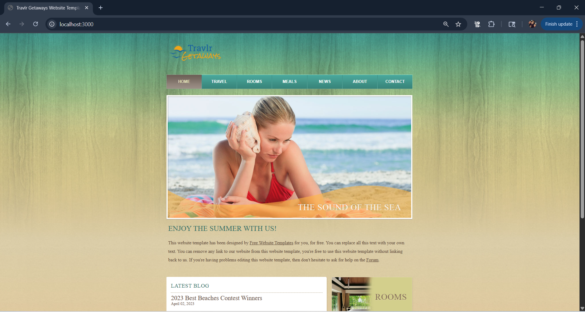
    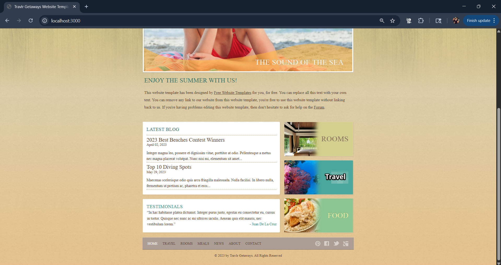
  </div>

</details>

## Travel

<details>
  <summary><strong>Show/Hide Preview</strong></summary>

  <div>
    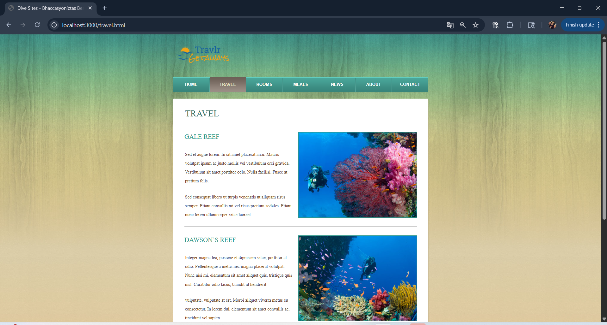
    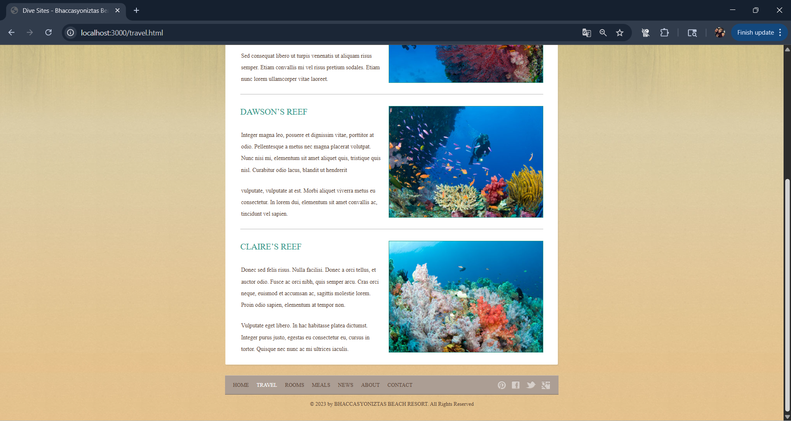
  </div>

</details>

## Rooms

<details>
  <summary><strong>Show/Hide Preview</strong></summary>

  <div>
    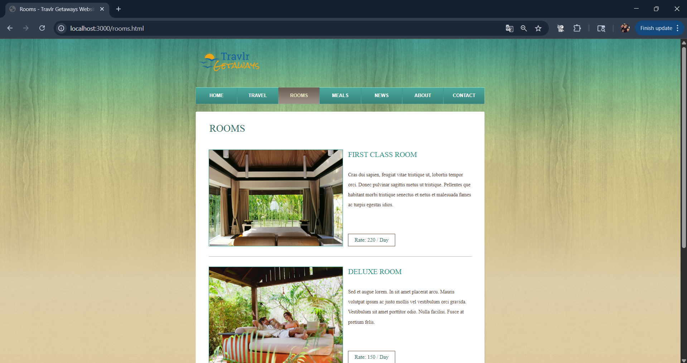
    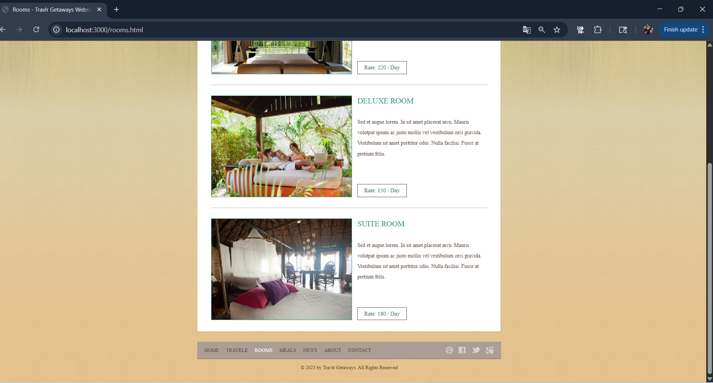
  </div>

</details>

## Meals

<details>
  <summary><strong>Show/Hide Preview</strong></summary>

  <div>
    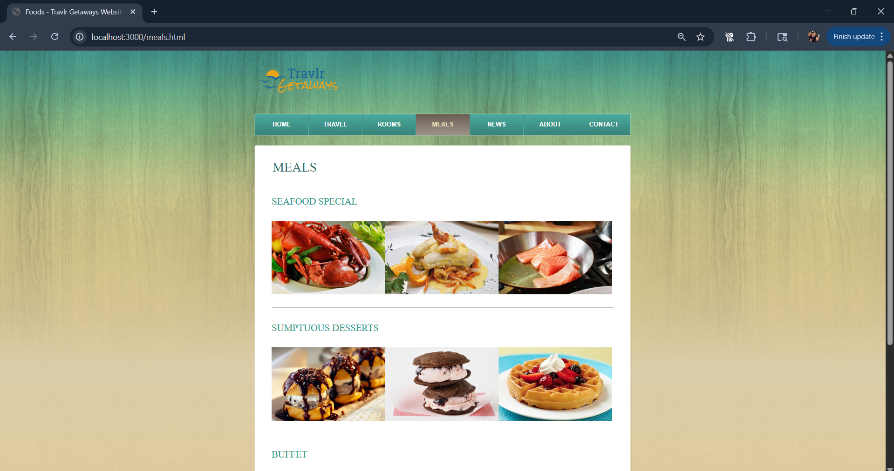
    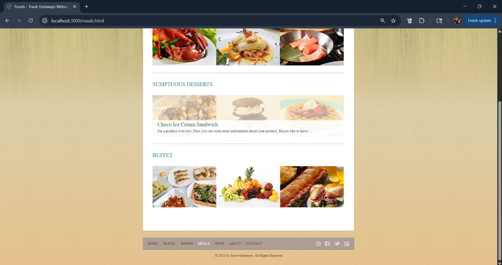
  </div>

</details>

## News

<details>
  <summary><strong>Show/Hide Preview</strong></summary>

 <div>
    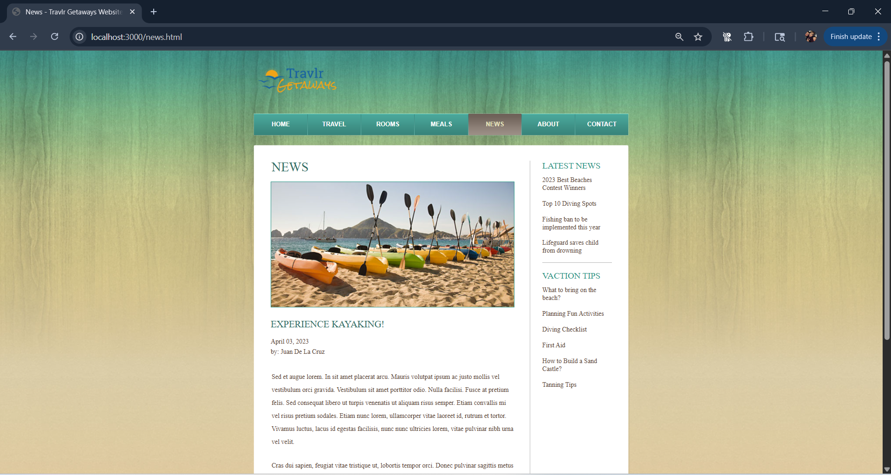
    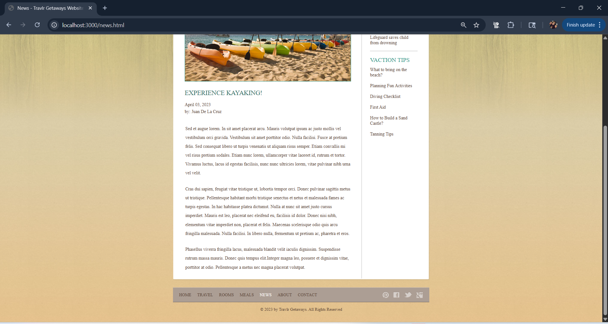
  </div>

</details>

## About

<details>
  <summary><strong>Show/Hide Preview</strong></summary>

  <div>
    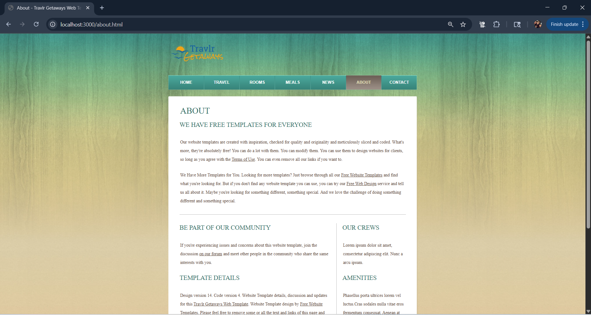
    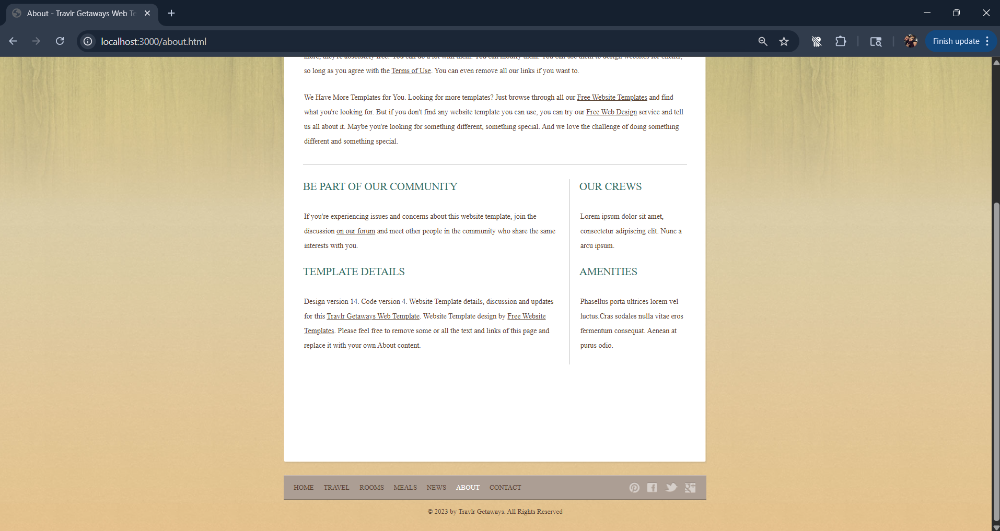
  </div>

</details>

## Contact

<details>
  <summary><strong>Show/Hide Preview</strong></summary>

  <div>
    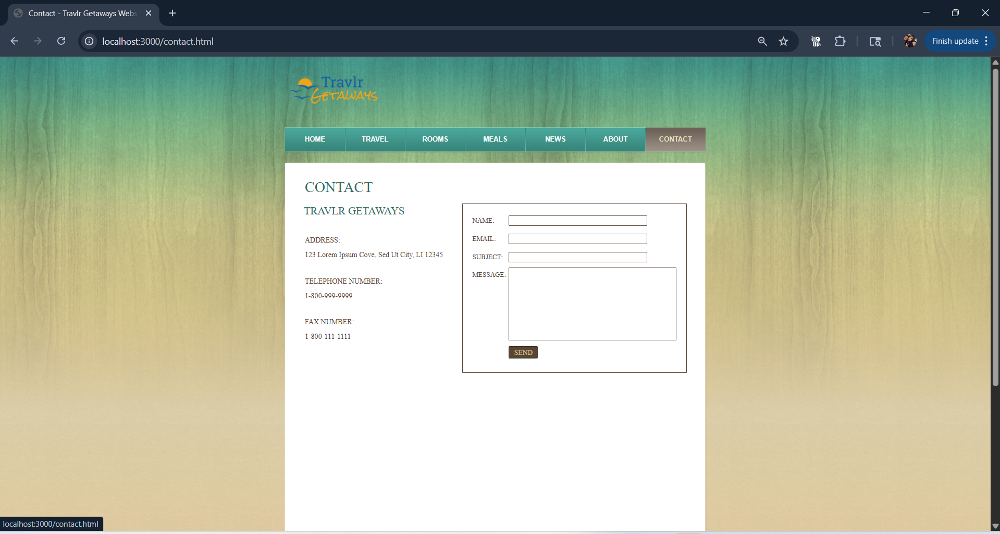
    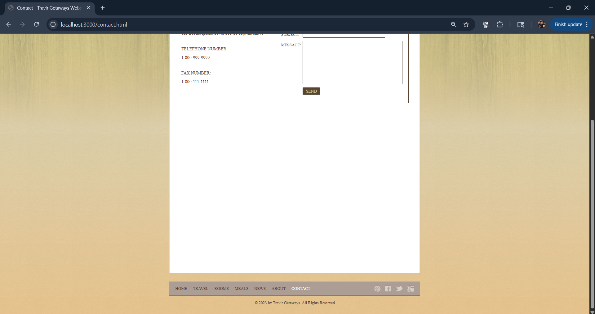
  </div>

</details>

---

# Tech Stack

<details open>
  <summary><strong>Show / Hide</strong></summary>

- **Node.js** – JavaScript runtime  
- **Express.js** – web framework  
- **Handlebars (express-handlebars)** – templating engine 
- **JavaScript (ES6+)** – core language
- **HTML5 & CSS3** – structure & style  
- **Git** – version control
  
  </details>

  ---

# Prerequisites

## 1. Windows PowerShell Script Execution Policy (Windows Users Only)
<details open>
  <summary><strong>Show / Hide</strong></summary>

<div align="center">
  <table>
    <tr>
      <td align="center">
        <a href="https://learn.microsoft.com/en-us/powershell/" target="_blank">
          
        </a>
      </td>
    </tr>
    <tr>
      <td align="center">
        <em><strong><a href="https://learn.microsoft.com/en-us/powershell/" target="_blank">Learn More</a></strong></em><br>Windows PowerShell
      </td>
    </tr>
  </table>
</div>

*Some npm-based tools create or run local PowerShell scripts. If you are on Windows and have never adjusted your execution policy, you may need to allow local scripts before running the project for the first time.*

### Check current policy
    Get-ExecutionPolicy -List

### Enable local scripts
    Set-ExecutionPolicy RemoteSigned -Scope CurrentUser

### Verify the change
    Get-ExecutionPolicy -List

You should now see **RemoteSigned** listed for **CurrentUser**.

*Note – On domain-joined machines you may need administrator rights or a Group Policy update. If you are unsure, contact your system administrator before changing policies.*

</details>

## 2. Web Browser
<details open>
  <summary><strong>Show / Hide</strong></summary>

A modern browser like Chrome, Firefox, Edge, or Safari to view the site.

Click a browser icon below to be taken to the download page for that browser. </p>

<div align="center" valign="middle">
<table>
  <tr>
    <td align="center">
      <a href="https://www.google.com/chrome/" target="_blank">
        
      </a>
    </td>
    <td align="center" valign="middle">
      <a href="https://www.mozilla.org/firefox/" target="_blank">
        
      </a>
    </td>
    <td align="center" valign="middle">
      <a href="https://www.microsoft.com/edge" target="_blank">
        
      </a>
    </td>
    <td align="center" valign="middle">
      <a href="https://www.apple.com/safari/" target="_blank">
        
      </a>
    </td>
  </tr>
  <tr>
    <td align="center" valign="top">
      <em><strong><a href="https://www.google.com/chrome/" target="_blank">Download</a></strong></em><br>Google Chrome
    </td>
    <td align="center" valign="top">
	    <em><strong><a href="https://www.mozilla.org/firefox/" target="_blank">Download </a></strong></em><br> Mozilla Firefox
    </td>
    <td align="center" valign="top">
      <em><strong><a href="https://www.microsoft.com/edge" target="_blank">Download</a></strong></em><br>Microsoft Edge
    </td>
    <td align="center" valign="top">
	    <em><strong><a href="https://www.apple.com/safari/" target="_blank">Download</a></strong></em><br>Apple Safari
    </td>
  </tr>
</table>
</div>

</details>

---

## 3. Visual Studio (VS) Code:
<details open>
  <summary><strong>Show / Hide</strong></summary>

<div align="center">
	<table>
		<tr>
			<td align="center">
				<a href="https://code.visualstudio.com" target="_blank">
				</a>
			</td>
		</tr>
		<tr>
			<td align="center" valign="top">
				<strong><em><a href="https://code.visualstudio.com" target="_blank">Download</a></em></strong><br>Visual Studio Code
			</td>
		</tr>
	</table>
</div>

*Here's a step-by-step guide to installing Visual Studio Code (VS Code) on your computer, primarily for Windows, with noted differences for macOS and Linux:*  

### Download the installer:
- Open your web browser and go to the official Visual Studio Code website: [code.visualstudio.com](https://code.visualstudio.com).
- Click on the "Download" button for your operating system (Windows, macOS, or Linux).
- The installer file (e.g., `VSCodeUserSetup-x64-1.x.x.exe` for Windows) will begin downloading.  

### Launch the installer:
- Once the download is complete, locate the installer file in your Downloads folder.
- Double-click the installer file to launch the installation process.  

### Follow the installation prompts:
- ***Accept the License Agreement:*** Read and accept the license agreement, then click "Next".
- ***Choose Installation Location:*** The default location is usually fine, but you can choose a different location if needed. Click "Next".
- ***Start Menu Folder:*** Keep the default Start Menu folder name or change it as desired. Click "Next".
    - **Additional Tasks:**
      - On Windows, consider checking the boxes for creating a desktop icon and adding "Open with Code" to the right-click context menu (these are useful shortcuts).
      - Ensure the "Add to PATH" option is checked (usually the default) as this allows you to launch VS Code from your terminal or command prompt.
      - Click "Next".
- ***Confirm Installation:*** Review your selections and click "Install".
- The installation will proceed.
- Click "Finish" to exit the installer and launch Visual Studio Code (by default).

- **For macOS users:**  
    - Download the macOS version.
    - Open the downloaded `.dmg` file.
    - Drag the Visual Studio Code.app to your Applications folder.
    - Optionally add it to your Dock by right-clicking the icon and choosing "Options" → "Keep in Dock".

- **For Linux users (Debian/Ubuntu):**        - Download the `.deb` package.
    - Install it through your graphical software center or using the command line:
     ```bash
     sudo apt install ./<file>.deb
     ```
    - ***Note:*** The installer will prompt to add the apt repository for auto-updates.

</details>

---

## 4. Node.js & NPM
<details open>
  <summary><strong>Show / Hide</strong></summary>

<div align="center">
<table>
  <tr>
    <td align="center" valign="middle">
      <a href="https://nodejs.org" target="_blank">
        
      </a>
    </td>
    <td align="center" valign="middle">
      <a href="https://nodejs.org" target="_blank">
        
      </a>
    </td>
  </tr>
  <tr>
    <td colspan="2" align="center"  valign="middle">
	    <strong><em><a href="https://nodejs.org" target="_blank">Download</a></em></strong> <br> Node.js & NPM
    </td>
  </tr>
</table>
</div>

*Here's a step-by-step guide to installing Node.js (and npm, which is included) on your computer, primarily for Windows, with noted differences for macOS and Linux:*  

### Download the installer:
- Open your web browser and go to the official Node.js website: [nodejs.org](https://nodejs.org).
- Click the **LTS (Recommended for Most Users)** download button for your operating system (Windows, macOS, or Linux).
- The installer file (e.g., `node-vxx.x.x-x64.msi` for Windows) will begin downloading.  

### Launch the installer:
- Once the download is complete, locate the installer file in your Downloads folder.
- Double-click the installer file to begin the installation process.  

### Follow the installation prompts:
- ***Welcome Screen:*** Click "Next".
- ***License Agreement:*** Read and accept the license agreement, then click "Next".
- ***Choose Installation Location:*** The default location is usually fine, but you can choose a different folder if desired. Click "Next".
- ***Select Components:*** Leave the default components selected. Click "Next".
- ***Tools for Native Modules:*** (Optional) You may be prompted to install additional tools like Python and Visual Studio Build Tools. You can skip this unless you plan to use native modules. Click "Next".
- ***Ready to Install:*** Review your selections and click "Install".
- When installation finishes, click "Finish" to exit the installer.

- **For macOS users:**  
    - Download the `.pkg` file from the Node.js website.
    - Double-click it to launch the installer and follow the on-screen instructions.
    - Once complete, Node.js and npm will be available system-wide.

- **For Linux users (Debian/Ubuntu):**  
    - Open a terminal and run the following commands:
      ```bash
      sudo apt update
      sudo apt install nodejs npm
      ```

### Verify the installation:
- Open your terminal (Command Prompt, PowerShell, or Terminal).
- Run the following commands:
  ```bash
  node -v
  npm -v
  ```
- If Node.js and npm are installed correctly, you will see version numbers for both.

</details>

---

## 5. Express Generator (CLI):
<details open>
  <summary><strong>Show / Hide</strong></summary>

<div align="center">
<table>
  <tr>
    <td align="center" valign="middle">
      <a href="https://expressjs.com/en/starter/generator.html" target="_blank">
        
      </a>
    </td>
  </tr>
  <tr>
    <td align="center"  valign="middle">
	    <strong><em><a href="https://nodejs.org" target="_blank">Download</a></em></strong> <br> Express Generator
    </td>
  </tr>
</table>
</div>

The Express Generator scaffolds the baseline project for Module 1, creating an Express app pre-configured for Handlebars and equipped with a starter file structure.

### Install globally
```bash
npm install -g express-generator
```

### Verify installation
```bash
express --version
```
A version number (e.g., <code>4.18.2</code>) confirms that the generator is installed and ready to use.

</details>

## 6. Git:
<details open>
  <summary><strong>Show / Hide</strong></summary>

<div align="center">
	<table>
		<tr>
			<td align="center" valign="middle">
				<a href="https://code.visualstudio.com" target="_blank"></a>
			</td>
		</tr>
		<tr>
			<td align="center" valign="top">
			<strong><em><a href="https://code.visualstudio.com" target="_blank">Download</a></em></strong><br>Git
			</td>
		</tr>
	</table>
</div>

*Here's a step-by-step guide to installing Git on your computer, primarily for Windows, with noted differences for macOS and Linux:*  

### Download the installer:
- Open your web browser and go to the official Git website: [git-scm.com/downloads](https://git-scm.com/downloads).
- The site will automatically detect your operating system.
- Click the download link for **Windows**, **macOS**, or **Linux**.
- The installer file (e.g., `Git-2.x.x-x64.exe` for Windows) will begin downloading.  

### Launch the installer:
- Once the download is complete, locate the installer file in your Downloads folder.
- Double-click the installer file to begin the installation process.  

### Follow the installation prompts:
- ***Accept the License Agreement:*** Read and accept the license agreement, then click "Next".
- ***Choose Installation Location:*** The default location is usually fine, but you can choose a different location if needed. Click "Next".
- ***Select Components:*** Keep the default selections. Ensure “Git Bash Here” and “Git GUI Here” are checked.
- ***Choosing Default Editor:*** Choose your preferred code editor or leave the default (Vim or Notepad). Click "Next".
- ***Adjusting PATH Environment:*** Select “Git from the command line and also from 3rd-party software” (recommended). Click "Next".
- ***Other Configuration Settings:*** Leave default options selected unless you have a reason to change them.
- Click "Install" to begin installation.
- Click "Finish" to exit the installer when setup is complete.

- **For macOS users:**  
    - Git is available through the Xcode Command Line Tools.
    - Open the Terminal app and run:
      ```bash
      xcode-select --install
      ```
    - A popup window will appear. Click "Install" and wait for the installation to finish.

- **For Linux users (Debian/Ubuntu):**  
    - Open a terminal and run the following commands:
      ```bash
      sudo apt update
      sudo apt install git
      ```

### Verify the installation:
- Open your terminal (Command Prompt, PowerShell, Terminal, or Git Bash).
- Type the following and press Enter:
  ```bash
  git --version
  ```
- If Git is installed correctly, you will see the version number displayed.

</details>

---

# Installation & Usage

Follow these steps to set up the Module 1 project locally.  
You can use either the **Visual Studio (VS) Code method** or the **Command Line method** — both achieve the same result.

---

## Method 1 – Visual Studio (VS) Code
<details open>
  <summary><strong>Show / Hide</strong></summary>

  ### Create and scaffold the Express project
  - Launch **Visual Studio Code**.
  - Open the integrated terminal (**View > Terminal** or `Ctrl + \`` on Windows/Linux, `Cmd + \`` on macOS).
  - Navigate to (or create) your project folder:
    ```bash
    cd ~
    mkdir travlr
    cd travlr
    ```
  - Install the Express generator globally:
    ```bash
    npm install -g express-generator
    ```
  - Generate the app with Handlebars and a default `.gitignore`:
    ```bash
    express --view=hbs --git --force
    ```
  - Install dependencies:
    ```bash
    npm install
    ```
  - Start the development server:
    ```bash
    set DEBUG=travlr:*
    npm start
    ```
  - View the application at:
    ```
    http://localhost:3000/
    ```
  - Stop the server:
    ```
    Ctrl + C
    ```

</details>

---

## Method 2 – Command Line
<details open>
  <summary><strong>Show / Hide</strong></summary>

  ### Create and scaffold the Express project
  - Open **Command Prompt**, **PowerShell**, or **Terminal**.
  - Create and enter your project folder:
    ```bash
    cd ~
    mkdir travlr
    cd travlr
    ```
  - Install the Express generator:
    ```bash
    npm install -g express-generator
    ```
  - Generate the app with Handlebars and a default `.gitignore`:
    ```bash
    express --view=hbs --git --force
    ```
  - Install dependencies:
    ```bash
    npm install
    ```
  - Start the development server:
    ```bash
    set DEBUG=travlr:*
    npm start
    ```
  - View the application:
    ```
    http://localhost:3000/
    ```
  - Stop the server:
    ```
    Ctrl + C
    ```

</details>

---

## Install Static Web Files
<details open>
  <summary><strong>Show / Hide</strong></summary>

  1. Unzip the provided **travlr.zip** into your project folder.  
  2. Copy all `.html` files into **<code>public/</code>**.  
  3. Copy the **images** folder contents into **<code>public/images/</code>**.  
  4. Copy **style.css** into **<code>public/stylesheets/</code>**, then rename:
     ```
     public/stylesheets → public/css
     ```
  5. Restart the server:
     ```bash
     # stop
     Ctrl + C
     # restart
     npm start
     ```
  6. Reload <code>http://localhost:3000/</code> and confirm the site renders with styling.

</details>

---

## Finalize Module 1 in Git
<details open>
  <summary><strong>Show / Hide</strong></summary>

  - Create and switch to the Module 1 branch:
    ```bash
    git checkout -b module1
    ```
  - Stage and commit all files:
    ```bash
    git add .
    git commit -m "Baseline Express Website – static only"
    ```
  - Push to GitHub:
    ```bash
    git push --set-upstream origin module1
    ```

</details>

---

# File Structure
<details>
  <summary><strong>Show / Hide</strong></summary>

```
🗂️travlr
 ↳ 📁bin/
 |  ↳ 📄www
 ↳ 📁public/
 |  ↳ 📁css/
 |  |  ↳ 📄style.css
 |  ↳ 📁images/
 |     ↳ (all static site images)
 ↳ 📁routes/
 |  ↳ 📄index.js
 |  ↳ 📄users.js
 ↳ 📁views/
 |  ↳ 📄layout.hbs
 |  ↳ 📄index.hbs
 |  ↳ 📄error.hbs
 📄.gitignore
 📄app.js
 📄package.json
 📄package-lock.json
 📄README.md
```

</details>

---

# Acknowledgements
<details>
  <summary><strong>Show / Hide</strong></summary>

- Node.js  
- Express.js  
- Handlebars.js  
- Free Website Templates

</details>

---

---

# Contact

 <div align="center">
	 <h1> Developer </h1>
	 <h3><b><em> Alysha Purlsey </em></b></h3>
<h4><em><b> Please feel free to reach out to me using one of the contact detail links below with any comments, questions or concerns, or feedback and suggestions! 
 <br>
	<br>
 Thank you so much for taking the time to visit my profile and view this repository!
	</b></em></h4>
 </div>
	 

## GitHub Profile

***[alyshap2012](https://github.com/apursley2012)***

## University Email
***[alysha.pursley@snhu.edu](mailto:alysha.pursley@snhu.edu)***

## Personal Email
	 
***[alysha.pursley@gmail.com](mailto:alysha.pursley@gmail.com)***
	
