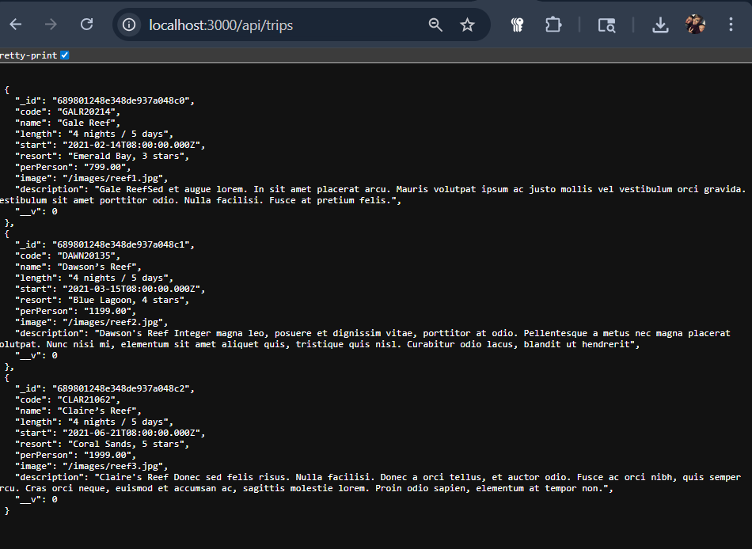
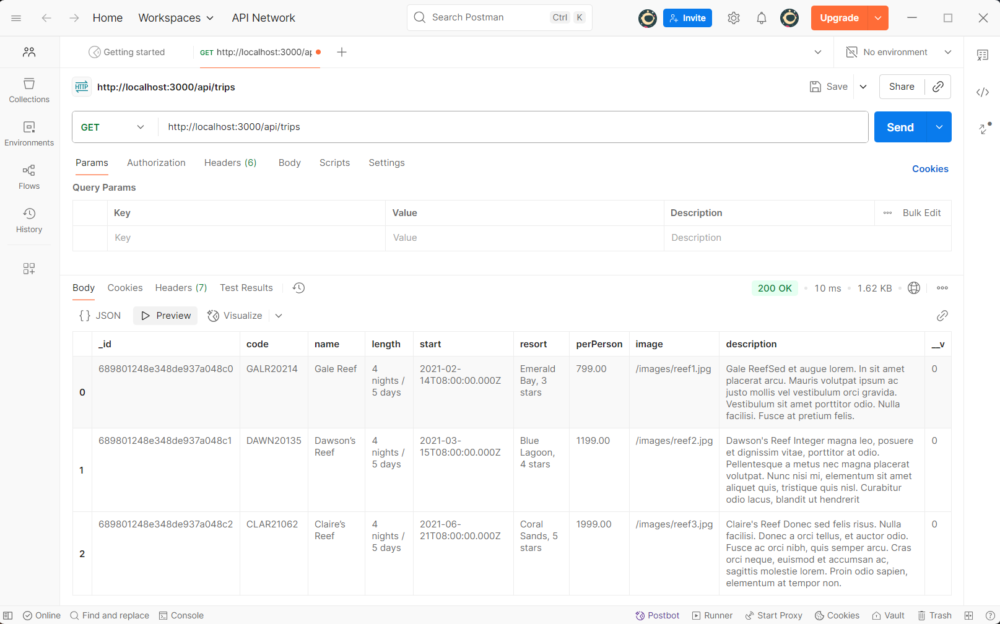
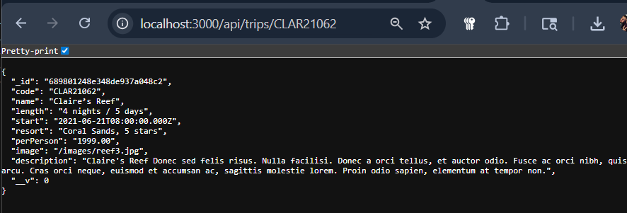
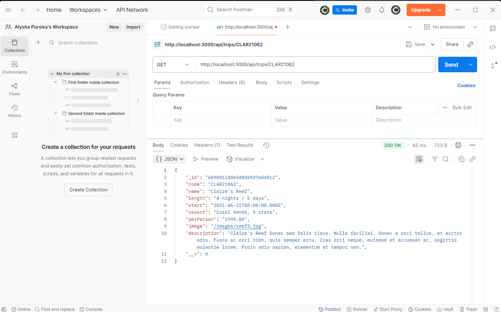

<a id="readme-top"></a>

  <div align="center">
      <h1> Travlr Getaways </h1>
      <h3><em> Module 5: RESTful API </em></h3>
  </div>

  

---

# Project Overview 

<div align="center">
  <p align="center"> Module 5 adds a RESTful API to Travlr Getaways. The Mongoose model from Module 4 is reused, but moved under <code>app_api/models/</code>. New API routes and controllers expose the trips data via <code>GET /api/trips</code> and <code>GET /api/trips/:tripCode</code>. <code>app.js</code> is updated to load the API-side database bootstrap and mount the API at <code>/api</code>. Optionally, the public Travel page can consume this API, but the core deliverable for Module 5 is the working API.
  </p>
  <a href="#prerequisites"><strong>Quick Start »</strong></a>
    &nbsp;&middot;&nbsp;
     <a href="#page-previews"><strong> API Previews »</strong></a>
    &nbsp;&middot;&nbsp;
	<a href="https://github.com/apursley2012/CS465-full-stack-dev-I/issues/new"><strong> Report Issue »</strong></a>
</p>
</div>
  
---

# Table of Contents

- [About the Project](#about-the-project)
- [Features](#features)
- [Page Previews](#page-previews)
  - [API: /api/trips](#api-apitrips)
  - [API: /api/trips/:tripCode](#api-apitripstripcode)
- [Tech Stack](#tech-stack)
- [Prerequisites](#prerequisites)
  - [1. Web Browser](#1-web-browser)
  - [2. Visual Studio (VS) Code](#2-visual-studio-vs-code)
  - [3. Node.js & NPM](#3-nodejs--npm)
  - [4. Git](#4-git)
  - [5. MongoDB Community Server](#5-mongodb-community-server)
  - [6. MongoDB Compass (Optional)](#6-mongodb-compass-optional)
- [Installation & Usage](#installation--usage)
	- [Method 1 - Visual Studio (VS) Code](#method-1---visual-studio-vs-code)
 	- [Method 2 - Command Line](#method-2---command-line)
  	- [Usage](#usage)
- [File Structure](#file-structure)
- [Acknowledgements](#acknowledgements)
- [Contact](#contact)
	- [Github Profile](#github-profile)
 	- [University Email](#university-email)
  	- [Personal Email](#personal-email) 


---


---

# About the Project

<details open>
  <summary><strong>Show / Hide</strong></summary>
	<br>
<p>
Module 5 delivers a <strong>RESTful API</strong> for trips. The data layer from Module 4 is moved under <code>app_api/models</code> so the API fully owns data access. An Express router mounted at <code>/api</code> exposes:
</p>

- <code>GET /api/trips</code> — returns all trips (JSON array)  
- <code>GET /api/trips/:tripCode</code> — returns one trip (JSON object) or 404

<p>
Key changes:
</p>

- Move DB bootstrap + model(s) to <code>app_api/models/</code> (model name stays <code>"trips"</code>).
- Add API controller(s) in <code>app_api/controllers/</code> and routes in <code>app_api/routes/</code>.
- Update <code>app.js</code> to <code>require('./app_api/models/db')</code> and <code>app.use('/api', require('./app_api/routes'))</code>.
- (Optional) Public Travel page can render by calling the API; not required for core Module 5.
</details>

---

# Features

<details open>
<summary><strong>Show / Hide</strong></summary>

- **RESTful Endpoints**
  - **GET** **`/api/trips`** — list all trips
  - **GET** **`/api/trips/:tripCode`** — find one trip by `code`
- **API-First Structure**
  - Models/DB under **`app_api/models`**
  - Controllers under **`app_api/controllers`**
  - Routes under **`app_api/routes`**
  - Mounted via **`app.use('/api', apiRouter)`**
- **Reuses Existing Mongoose Model**
  - Trip schema registered once as **`"trips"`**
  - Optional shim **`app_api/models/trips.js`** re-exports the real model (`travlr.js`)
- **Centralized DB Loader (API side)**
  - `app_api/models/db.js` connects and loads the model once
- **Public Integration (Implemented)**
  - <em>Travel</em> page now fetches `http://localhost:3000/api/trips` server-side and renders the results
- **Git Workflow**
  - Work on `module5` branch; commit API and wiring changes

</details>
---

# Page Previews
<details>
<summary><strong>Show / Hide</strong></summary>

## API: /api/trips

<details>
  <summary><strong>Show/Hide Preview</strong></summary>

  <div align="center">
    
    
  </div>

</details>

## API: /api/trips/:tripCode

<details>
  <summary><strong>Show/Hide Preview</strong></summary>

  <div align="center">
    
    
  </div>

</details>

</details>


---

# Tech Stack

<details open>
  <summary><strong>Show / Hide</strong></summary>

- **Node.js** – Backend runtime  
- **Express.js** – Web framework + Router for RESTful endpoints  
- **MongoDB** – NoSQL database (collection: `trips`)  
- **Mongoose** – ODM; model registered as `"trips"`  
- **Handlebars (express-handlebars)** – Public views (Travel uses API)  
- **JSON** – Seed/sample data format (`data/trips.json`)  
- **Git** – Version control / branching (`module5`)

</details>

---

# Prerequisites

## 1. Web Browser
<details open>
  <summary><strong>Show / Hide</strong></summary>

A modern browser like Chrome, Firefox, Edge, or Safari to view the site.

Click a browser icon below to be taken to the download page for that browser. </p>

<div align="center" valign="middle">
<table>
  <tr>
    <td align="center">
      <a href="https://www.google.com/chrome/" target="_blank">
        
      </a>
    </td>
    <td align="center" valign="middle">
      <a href="https://www.mozilla.org/firefox/" target="_blank">
        
      </a>
    </td>
    <td align="center" valign="middle">
      <a href="https://www.microsoft.com/edge" target="_blank">
        
      </a>
    </td>
    <td align="center" valign="middle">
      <a href="https://www.apple.com/safari/" target="_blank">
        
      </a>
    </td>
  </tr>
  <tr>
    <td align="center" valign="top">
      <em><strong><a href="https://www.google.com/chrome/" target="_blank">Download</a></strong></em><br>Google Chrome
    </td>
    <td align="center" valign="top">
	    <em><strong><a href="https://www.mozilla.org/firefox/" target="_blank">Download </a></strong></em><br> Mozilla Firefox
    </td>
    <td align="center" valign="top">
      <em><strong><a href="https://www.microsoft.com/edge" target="_blank">Download</a></strong></em><br>Microsoft Edge
    </td>
    <td align="center" valign="top">
	    <em><strong><a href="https://www.apple.com/safari/" target="_blank">Download</a></strong></em><br>Apple Safari
    </td>
  </tr>
</table>
</div>

</details>

---

## 2. Visual Studio (VS) Code:
<details open>
  <summary><strong>Show / Hide</strong></summary>

<div align="center">
	<table>
		<tr>
			<td align="center">
				<a href="https://code.visualstudio.com" target="_blank">
				</a>
			</td>
		</tr>
		<tr>
			<td align="center" valign="top">
				<strong><em><a href="https://code.visualstudio.com" target="_blank">Download</a></em></strong><br>Visual Studio Code
			</td>
		</tr>
	</table>
</div>

*Here's a step-by-step guide to installing Visual Studio Code (VS Code) on your computer, primarily for Windows, with noted differences for macOS and Linux:*  

### Download the installer:
- Open your web browser and go to the official Visual Studio Code website: [code.visualstudio.com](https://code.visualstudio.com).
- Click on the "Download" button for your operating system (Windows, macOS, or Linux).
- The installer file (e.g., `VSCodeUserSetup-x64-1.x.x.exe` for Windows) will begin downloading.  

### Launch the installer:
- Once the download is complete, locate the installer file in your Downloads folder.
- Double-click the installer file to launch the installation process.  

### Follow the installation prompts:
- ***Accept the License Agreement:*** Read and accept the license agreement, then click "Next".
- ***Choose Installation Location:*** The default location is usually fine, but you can choose a different location if needed. Click "Next".
- ***Start Menu Folder:*** Keep the default Start Menu folder name or change it as desired. Click "Next".
    - **Additional Tasks:**
      - On Windows, consider checking the boxes for creating a desktop icon and adding "Open with Code" to the right-click context menu (these are useful shortcuts).
      - Ensure the "Add to PATH" option is checked (usually the default) as this allows you to launch VS Code from your terminal or command prompt.
      - Click "Next".
- ***Confirm Installation:*** Review your selections and click "Install".
- The installation will proceed.
- Click "Finish" to exit the installer and launch Visual Studio Code (by default).

- **For macOS users:**  
    - Download the macOS version.
    - Open the downloaded `.dmg` file.
    - Drag the Visual Studio Code.app to your Applications folder.
    - Optionally add it to your Dock by right-clicking the icon and choosing "Options" → "Keep in Dock".

- **For Linux users (Debian/Ubuntu):**        - Download the `.deb` package.
    - Install it through your graphical software center or using the command line:
     ```bash
     sudo apt install ./<file>.deb
     ```
    - ***Note:*** The installer will prompt to add the apt repository for auto-updates.

</details>

---

## 3. Node.js & NPM
<details open>
  <summary><strong>Show / Hide</strong></summary>

<div align="center">
<table>
  <tr>
    <td align="center" valign="middle">
      <a href="https://nodejs.org" target="_blank">
        
      </a>
    </td>
    <td align="center" valign="middle">
      <a href="https://nodejs.org" target="_blank">
        
      </a>
    </td>
  </tr>
  <tr>
    <td colspan="2" align="center"  valign="middle">
	    <strong><em><a href="https://nodejs.org" target="_blank">Download</a></em></strong> <br> Node.js & NPM
    </td>
  </tr>
</table>
</div>

*Here's a step-by-step guide to installing Node.js (and npm, which is included) on your computer, primarily for Windows, with noted differences for macOS and Linux:*  

### Download the installer:
- Open your web browser and go to the official Node.js website: [nodejs.org](https://nodejs.org).
- Click the **LTS (Recommended for Most Users)** download button for your operating system (Windows, macOS, or Linux).
- The installer file (e.g., `node-vxx.x.x-x64.msi` for Windows) will begin downloading.  

### Launch the installer:
- Once the download is complete, locate the installer file in your Downloads folder.
- Double-click the installer file to begin the installation process.  

### Follow the installation prompts:
- ***Welcome Screen:*** Click "Next".
- ***License Agreement:*** Read and accept the license agreement, then click "Next".
- ***Choose Installation Location:*** The default location is usually fine, but you can choose a different folder if desired. Click "Next".
- ***Select Components:*** Leave the default components selected. Click "Next".
- ***Tools for Native Modules:*** (Optional) You may be prompted to install additional tools like Python and Visual Studio Build Tools. You can skip this unless you plan to use native modules. Click "Next".
- ***Ready to Install:*** Review your selections and click "Install".
- When installation finishes, click "Finish" to exit the installer.

- **For macOS users:**  
    - Download the `.pkg` file from the Node.js website.
    - Double-click it to launch the installer and follow the on-screen instructions.
    - Once complete, Node.js and npm will be available system-wide.

- **For Linux users (Debian/Ubuntu):**  
    - Open a terminal and run the following commands:
      ```bash
      sudo apt update
      sudo apt install nodejs npm
      ```

### Verify the installation:
- Open your terminal (Command Prompt, PowerShell, or Terminal).
- Run the following commands:
  ```bash
  node -v
  npm -v
  ```
- If Node.js and npm are installed correctly, you will see version numbers for both.

</details>

---

## 4. Git:
<details open>
  <summary><strong>Show / Hide</strong></summary>

<div align="center">
	<table>
		<tr>
			<td align="center" valign="middle">
				<a href="https://code.visualstudio.com" target="_blank"></a>
			</td>
		</tr>
		<tr>
			<td align="center" valign="top">
			<strong><em><a href="https://code.visualstudio.com" target="_blank">Download</a></em></strong><br>Git
			</td>
		</tr>
	</table>
</div>

*Here's a step-by-step guide to installing Git on your computer, primarily for Windows, with noted differences for macOS and Linux:*  

### Download the installer:
- Open your web browser and go to the official Git website: [git-scm.com/downloads](https://git-scm.com/downloads).
- The site will automatically detect your operating system.
- Click the download link for **Windows**, **macOS**, or **Linux**.
- The installer file (e.g., `Git-2.x.x-x64.exe` for Windows) will begin downloading.  

### Launch the installer:
- Once the download is complete, locate the installer file in your Downloads folder.
- Double-click the installer file to begin the installation process.  

### Follow the installation prompts:
- ***Accept the License Agreement:*** Read and accept the license agreement, then click "Next".
- ***Choose Installation Location:*** The default location is usually fine, but you can choose a different location if needed. Click "Next".
- ***Select Components:*** Keep the default selections. Ensure “Git Bash Here” and “Git GUI Here” are checked.
- ***Choosing Default Editor:*** Choose your preferred code editor or leave the default (Vim or Notepad). Click "Next".
- ***Adjusting PATH Environment:*** Select “Git from the command line and also from 3rd-party software” (recommended). Click "Next".
- ***Other Configuration Settings:*** Leave default options selected unless you have a reason to change them.
- Click "Install" to begin installation.
- Click "Finish" to exit the installer when setup is complete.

- **For macOS users:**  
    - Git is available through the Xcode Command Line Tools.
    - Open the Terminal app and run:
      ```bash
      xcode-select --install
      ```
    - A popup window will appear. Click "Install" and wait for the installation to finish.

- **For Linux users (Debian/Ubuntu):**  
    - Open a terminal and run the following commands:
      ```bash
      sudo apt update
      sudo apt install git
      ```

### Verify the installation:
- Open your terminal (Command Prompt, PowerShell, Terminal, or Git Bash).
- Type the following and press Enter:
  ```bash
  git --version
  ```
- If Git is installed correctly, you will see the version number displayed.

</details>

---

## 5. MongoDB Community Server
<details open>
  <summary><strong>Show / Hide</strong></summary>

<div align="center">
  <table>
    <tr>
      <td align="center">
        <a href="https://www.mongodb.com/try/download/community" target="_blank">
          
        </a>
      </td>
    </tr>
    <tr>
      <td align="center" valign="top">
        <strong><em><a href="https://www.mongodb.com/try/download/community" target="_blank">Download</a></em></strong><br>MongoDB Community Server
      </td>
    </tr>
  </table>
</div>

*MongoDB is the NoSQL database used in Module 4 to store trips data.*

### Download the installer:
- **Windows:** Download the **.msi** (x64) from the link above.  
- **macOS:** Download the **.pkg** installer, or install via Homebrew (see below).  
- **Linux (Debian/Ubuntu):** Install from the official MongoDB repository (see below).

### Install:
- **Windows (.msi):**
  - Run the installer and accept the license.
  - Choose **Complete** setup.
  - On **Service Configuration**, keep defaults to install **MongoDB as a Windows Service**.
  - (Optional) Skip Compass here; you can install it separately in the next prerequisite.

- **macOS (.pkg) or Homebrew:**
  - Open the `.pkg` and proceed with defaults, **or** install with Homebrew:
    
        brew tap mongodb/brew
        brew install mongodb-community

- **Linux (Debian/Ubuntu) – official repo example:**
    
        sudo apt-get update
        sudo apt-get install -y gnupg curl
        curl -fsSL https://pgp.mongodb.com/server-7.0.asc | sudo gpg -o /usr/share/keyrings/mongodb-server-7.0.gpg --dearmor
        echo "deb [ signed-by=/usr/share/keyrings/mongodb-server-7.0.gpg ] https://repo.mongodb.org/apt/ubuntu $(lsb_release -sc)/mongodb-org/7.0 multiverse" | sudo tee /etc/apt/sources.list.d/mongodb-org-7.0.list
        sudo apt-get update
        sudo apt-get install -y mongodb-org

### Verify the installation:
- **Check versions**
    
        mongod --version
        mongosh --version

### Start / Stop the database service:
- **Windows (Service)**
    
        # Check service status
        Get-Service MongoDB

        # Start service
        Start-Service MongoDB

        # Stop service
        Stop-Service MongoDB

    Or with `net`:
    
        net start MongoDB
        net stop MongoDB

- **macOS (Homebrew)**
    
        # Start on login and now
        brew services start mongodb-community

        # Stop service
        brew services stop mongodb-community

        # Check
        brew services list | grep mongodb

- **Linux (Debian/Ubuntu)**
    
        # Start service
        sudo systemctl start mongod

        # Enable on boot
        sudo systemctl enable mongod

        # Check status
        sudo systemctl status mongod

        # Stop service
        sudo systemctl stop mongod

### (Optional) Create a data directory (only if you run `mongod` manually and see a data path error):
- **Windows**
    
        mkdir C:\data\db

- **macOS / Linux**
    
        sudo mkdir -p /data/db
        sudo chown "$(whoami)" /data/db

### (Optional) Quick connectivity check with the shell:
    
        mongosh "mongodb://127.0.0.1:27017"
        # Inside mongosh:
        use travlr
        db.runCommand({ ping: 1 })
        exit

</details>

---

## 6. MongoDB Compass (Optional)
<details open>
  <summary><strong>Show / Hide</strong></summary>

<div align="center">
  <table>
    <tr>
      <td align="center" valign="middle">
        <a href="https://www.mongodb.com/products/compass" target="_blank">
          
        </a>
      </td>
    </tr>
    <tr>
      <td align="center" valign="top">
        <strong><em><a href="https://www.mongodb.com/products/compass" target="_blank">Download</a></em></strong><br>MongoDB Compass
      </td>
    </tr>
  </table>
</div>

*MongoDB Compass is the GUI used in Module 4 to view the `travlr` database and the `trips` collection.*

### Download the installer:
- **Windows:** Download the **.msi** (x64) installer from the link above.  
- **macOS:** Download the **.dmg** installer for Apple silicon or Intel (match your Mac).  
- **Linux:** Download the **.AppImage** (or `.deb`/`.rpm` if offered for your distro).

### Install:
- **Windows (.msi):**
  - Run the installer and accept the defaults.
  - Allow a desktop/start menu shortcut if prompted.

- **macOS (.dmg):**
  - Open the `.dmg`, then drag **MongoDB Compass** into **Applications**.

- **Linux (AppImage example):**
  
        chmod +x ~/Downloads/mongodb-compass-*.AppImage
        ~/Downloads/mongodb-compass-*.AppImage

  - For `.deb` / `.rpm`, install with your package manager.

### Verify the installation:
- **Launch Compass**
  - **Windows:** Start Menu → *MongoDB Compass*  
  - **macOS:** Applications → *MongoDB Compass*  
  - **Linux:** Run the AppImage or launch from your applications menu

- **Connect to your local database**
  - In the **Connection String** box, enter:
  
        mongodb://127.0.0.1:27017

  - Click **Connect**.
  - If you get a connection error, make sure MongoDB Server is running (see **MongoDB Community Server** above for start instructions).

### Browse your data (used in Module 4):
- In the left sidebar, select the **travlr** database.
- Open the **trips** collection to see the seeded documents.
- Use **Filter** to search, and **Documents** tab to view records in table or JSON view.

### Troubleshooting:
- **Connection refused / timeout:** Start MongoDB Server and try again.
- **Empty database list:** Run your seed script to load sample data, then reconnect.
- **Permissions on Linux:** If Compass won’t launch, ensure the AppImage is executable or install the `.deb`/`.rpm` package.

</details>

---

## 7. API Client (Postman) – Optional
<details open>
  <summary><strong>Show / Hide</strong></summary>

Use an API client to test endpoints with headers, params, and pretty JSON.

<div align="center">
  <table>
    <tr>
      <td align="center" valign="middle">
        <a href="https://www.mongodb.com/products/compass" target="_blank">
          
        </a>
      </td>
    </tr>
    <tr>
      <td align="center" valign="top">
        <strong><em><a href="https://www.mongodb.com/products/compass" target="_blank">Download</a></em></strong><br>MongoDB Compass
      </td>
    </tr>
  </table>
</div>

---

## Installation & Usage 

Follow these steps to clone the repo and run **Module 5** locally. You should not need to edit any code.

---

### Prerequisites
- **Node.js (LTS)** and **npm** installed.
- **MongoDB Community Server** running locally on `mongodb://127.0.0.1:27017`.

Start MongoDB (pick one):

    ```bash
    net start MongoDB
    # OR (in a separate terminal)
    mongod
	```

> If your local MongoDB does not already contain `travlr.trips` data (from Module 4), run the seed script in **Step 3** once. This is not a code change—just a one-time command.

---

### 1) Get the code
    ```bash
    git clone https://github.com/apursley2012/CS465-full-stack-dev-I.git
    cd CS465-full-stack-dev-I
    git checkout module5
	```

### 2) Install dependencies
    ```bash
    npm install
	```

### 3) (First run only) Seed the database
    ```bash
    node app_server/models/seed.js
	```

Expected: connects to `mongodb://127.0.0.1/travlr` and inserts trip documents into the `trips` collection.

### 4) Start the app
    ```bash
    npm start```

You should see something like:

    ```
	> node ./bin/www
    Listening on port 3000
	```

### 5) Test the RESTful API
- **List all trips:** `http://localhost:3000/api/trips`  
- **Single trip by code:** `http://localhost:3000/api/trips/<REAL_TRIP_CODE>`

### 6) Test the Travel page (optional enhancement implemented)
- `http://localhost:3000/travel`

### 7) Stop the server
- Press **Ctrl + C** in the terminal.

---

### API Endpoints
- **GET** `/api/trips` → Returns all trips as JSON.  
- **GET** `/api/trips/:tripCode` → Returns a single trip by its code (404 if not found).

**Example JSON response:**

    ```json
    {
      "code": "GALR20214",
      "name": "Gale Reef",
      "length": "4 nights / 5 days",
      "start": "2021-02-14T08:00:00.000Z",
      "resort": "Emerald Bay, 3 stars",
      "perPerson": "799.00",
      "image": "/images/reef1.jpg",
      "description": "Gale Reef Sed et augue lorem..."
    }
	```

---

### Troubleshooting (no code edits)
- **MongoDB not running** → Start the service (`net start MongoDB`) or run `mongod`.
- **Empty API results** → Run the seed script once: `node app_server/models/seed.js`.
- **404 on `/api/trips`** → Ensure the app is running at `http://localhost:3000` and you’re on the **module5** branch.
- **500 errors** → Check terminal output for stack traces; most often MongoDB isn’t started.

### Troubleshooting (no code edits)
- **MongoDB not running** → Start the service (`net start MongoDB`) or run `mongod`.
- **Empty API results** → Run the seed script once: `node app_server/models/seed.js`.
- **404 on `/api/trips`** → Ensure the app is running at `http://localhost:3000` and you’re on the **module5** branch.
- **500 errors** → Check terminal output for stack traces; most often MongoDB isn’t started.

---

# File Structure
<details>
<summary><strong>Show / Hide</strong></summary>

```
🗂️ app_api/
 ↳📁 controllers/
 |  ↳📄 trips.js               
 ↳📁 models/
 |  ↳📄 db.js                  
 |  ↳📄 travlr.js              
 |  ↳📄 trips.js               
 ↳📁 routes/
 |  ↳📄 index.js               
🗂️ app_server/
 ↳📁 controllers/
 |  ↳📄 index.js
 |  ↳📄 main.js
 |  ↳📄 meals.js
 |  ↳📄 news.js
 |  ↳📄 rooms.js
 |  ↳📄 travel.js
 |  ↳📄 about.js
 |  ↳📄 contact.js
 ↳📁 models/
 |  ↳📄db.js
 |  ↳📄travlr.js
 |  ↳📄seed.js
 ↳📁 routes/
 |  ↳📄about.js
 |  ↳📄 contact.js
 |  ↳📄index.js
 |  ↳📄meals.js
 |  ↳📄rooms.js
 |  ↳📄travel.js
 |  ↳📄news.js
 ↳ 📁views/
 |  ↳ 📁 layouts/
 |     ↳ 📄layout.hbs
 |  ↳ 📄travel.hbs
 |  ↳ 📄rooms.hbs
 |  ↳ 📄news.hbs
 |  ↳  📁 partials/
 |  |   ↳📄header.hbs
 |  |   ↳📄footer.hbs
 |  ↳ 📄meals.hbs
 |  ↳ 📄index.hbs
 |  ↳ 📄error.hbs
 |  ↳ 📄contact.hbs
 |  ↳ 📄about.hbs
🗂️ bin/
 ↳ 📄www
🗂️ data/
 ↳ 📄about.json
 ↳ 📄contact.json
 ↳ 📄index.json
 ↳ 📄meals.json
 ↳ 📄news.json
 ↳ 📄rooms.json
 ↳ 📄trips.json
🗂️ public/
 ↳ 📁 css/
 |  ↳ 📄style.css
 ↳ 📁 images/
📄.gitignore 
📄app.js
📄package-lock.json 
📄package.json 
📄README.md
```

</details>

---

# Acknowledgements
<details>
  <summary><strong>Show / Hide</strong></summary>

- Node.js  
- Express.js  
- Handlebars.js  
- MongoDB Community Server  
- MongoDB Compass  
- Mongoose  
- Git & GitHub  
- Visual Studio Code  
- Free Website Templates
- Postman

</details>

---

# Contact

 <div align="center">
	 <h1> Developer </h1>
	 <h3><b><em> Alysha Purlsey </em></b></h3>
<h4><em><b> Please feel free to reach out to me using one of the contact detail links below with any comments, questions or concerns, or feedback and suggestions! 
 <br>
	<br>
 Thank you so much for taking the time to visit my profile and view this repository!
	</b></em></h4>
 </div>

## GitHub Profile

***[alyshap2012](https://github.com/apursley2012)***

## University Email
***[alysha.pursley@snhu.edu](mailto:alysha.pursley@snhu.edu)***

## Personal Email
	 
***[alysha.pursley@gmail.com](mailto:alysha.pursley@gmail.com)***
